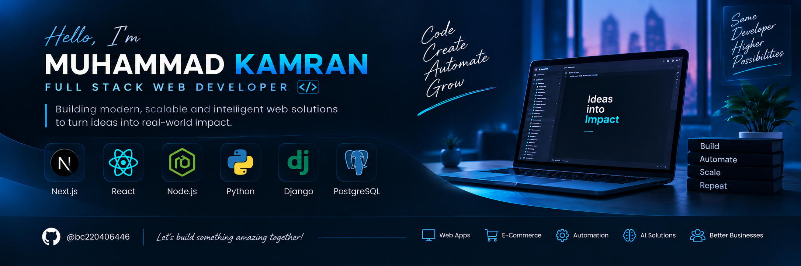

  

# About Me:
I’m a Full Stack Web Developer passionate about building modern, scalable, and user-focused web applications. I work with technologies across frontend and backend development, and specialize in WordPress, Shopify, e-commerce solutions, and AI-powered web applications and automation. I enjoy turning ideas into practical digital products, exploring new technologies, and building solutions that make businesses and everyday tasks smarter and more efficient.

## 🌐 Socials:
   

# 💻 Tech Stack:
                                                      
# 📊 GitHub Stats:
 
 

### ✍️ Random Dev Quote

<!-- Proudly created with GPRM ( https://gprm.itsvg.in ) -->
